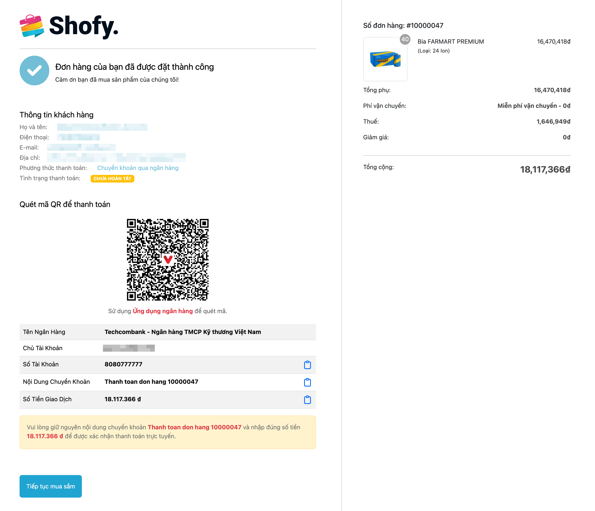

# Mã QR Chuyển Tiền Ngân Hàng Việt Nam

Plugin này cho phép bạn hiển thị mã QR code chuyển tiền qua các ứng dụng
ngân hàng ở Việt Nam theo tiêu chuẩn của VietQR khi khách hàng chọn hình
thức thanh toán theo dạng chuyển khoản.

Bạn cần cấu hình thông tin tài khoản ngân hàng Việt Nam trong cổng
thanh toán khi sử dụng tính năng này.

## Yêu cầu tối thiểu

-   Botble core 7.2.3 hoặc cao hơn.

## Cài đặt

### Cài đặt thông qua bảng quản trị

Vào **Bảng quản trị (Admin)** và chọn **Plugins**. Bấm vào nút "Thêm mới (Add new)", tìm kiếm plugin **Mã QR Chuyển Tiền Ngân Hàng Việt Nam** và sau đó bấm vào "Cài đặt (Install)".

### Cài đặt thủ công

1. Bạn có thể tải về các bản phát hình tại đây hoặc trên [Botble Marketplace](https://marketplace.botble.com/products/friendsofbotble/fob-vietnam-bank-qr).
2. Giải nén file nén vào thư mục `platform/plugins`.
3. Vào **Bảng quản trị (Admin)** và chọn **Plugins** và bấm vào nút **Kích hoạt (Activate)**.

Xem video hướng dẫn cấu hình tại đây:

https://youtu.be/VPLoNB6Y230?si=B9yr67fAzqqKqkpn

## Lịch sử thay đổi

Vui lòng xem [LỊCH SỬ THAY ĐỔI](CHANGELOG.md) để xem chi tiết.

## Bảo mật

Nếu bạn phát hiện bất kỳ vấn đề liên quan đến bảo mật nào, vui lòng gửi email tới friendsofbotble@gmail.com thay vì sử dụng issues.

## Credits

-   [Friends Of Botble](https://github.com/FriendsOfBotble)
-   [All Contributors](../../contributors)

## Giấy phép

MIT License (MIT). Vui lòng đọc trong phần [thông tin giấy phép](LICENSE).
